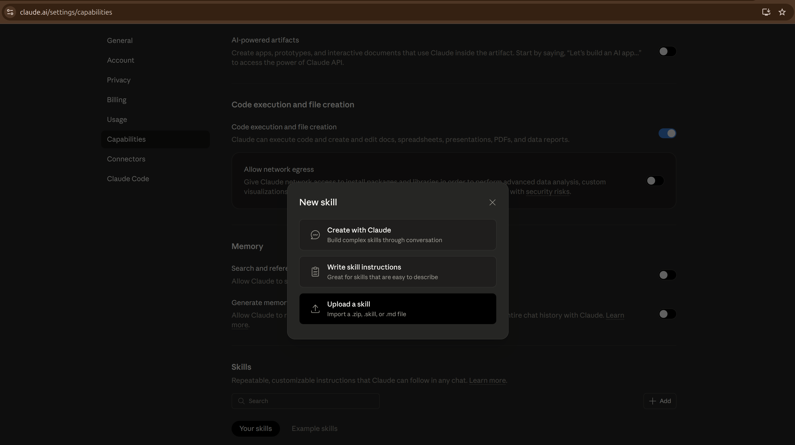

# orbitant-os

> The future will be AI or nothing at all.

Orbitant's toolkit — a plugin marketplace of skills, agents, and commands organized by vertical. Compatible with Claude Code, Claude.ai, and the Claude API.

## Quick Start

### Claude Code (recommended)

```bash
# 1. Register the marketplace (one-time setup)
/plugin marketplace add weorbitant/orbitant-os

# 2. Install the vertical you need
/plugin install orbitant-marketing

# 3. Update when there are new versions
/plugin update
```

**Uninstalling:**

```bash
# Remove a plugin
/plugin uninstall orbitant-marketing

# Remove the marketplace
/plugin marketplace remove weorbitant/orbitant-os
```

### Claude.ai / Claude Desktop

**Installing:**

1. Download the skill folder you need as a `.zip`
2. Go to **Settings > Capabilities > Skills**
3. Click **Upload skill** and select the zip



**Uninstalling:**

1. Go to **Settings > Capabilities > Skills**
2. Find the skill under "Your skills"
3. Click the skill and select **Delete**

### Other AI Agents (via skills.sh)

Use [skills.sh](https://skills.sh) to install skills on any supported agent (Cursor, Cline, Windsurf, Codex, GitHub Copilot, and 40+ more):

```bash
# Install a specific skill to Claude Code
npx skills add weorbitant/orbitant-os --skill orbitant-blog-post-review --agent claude-code -y

# Install to Cursor
npx skills add weorbitant/orbitant-os --skill orbitant-blog-post-review --agent cursor -y

# List available skills before installing
npx skills add weorbitant/orbitant-os --list
```

This is useful when:
- You want to use skills outside of Claude Code's plugin system
- You're using a different AI coding agent
- You need to install skills in CI/CD pipelines (see [Using Skills in GitHub Actions](#using-skills-in-github-actions))

### Claude API

Use the `/v1/skills` endpoint. See [Skills API docs](https://docs.claude.com/en/api/skills).

## Available Plugins

| Plugin | Status | Skills |
|--------|--------|--------|
| **orbitant-marketing** | v1.0.0 | `orbitant-blog-post-review` |

## Repo Structure

```
orbitant-os/
├── .claude/
│   └── CLAUDE.md                   <- project instructions for Claude
├── .claude-plugin/
│   └── marketplace.json            <- marketplace manifest
├── plugins/
│   └── orbitant-marketing/
│       ├── .claude-plugin/
│       │   └── plugin.json
│       └── skills/
│           └── blog-post-review/
│               └── SKILL.md
├── .github/
│   ├── assets/                     <- images and screenshots
│   ├── schemas/                    <- JSON schemas for validation
│   └── workflows/
│       └── validate.yml            <- CI pipeline
├── scripts/                        <- validation scripts
├── .gitignore
├── CONTRIBUTING.md
├── FAQ.md
├── LICENSE
├── package.json
└── README.md
```

## How It Works

Each vertical is an independent **plugin** with its own namespace. This means:

- **No collisions**: Skills use prefixed names (e.g., `orbitant-blog-post-review`) so Claude can distinguish them from community skills.
- **Install only what you need**: A marketer doesn't need infra skills, and vice versa.

### Component Types

| Component | What it is | How it triggers |
|-----------|-----------|-----------------|
| **Skills** | Instructions Claude loads automatically when relevant | Claude reads the `description` and decides |
| **Agents** | Specialized sub-agents with restricted tools | Invoked via slash command or by another agent |
| **Commands** | Slash commands invoked manually | User types `/orbitant-marketing:command-name` |

## Adding New Skills

1. Create a folder under the right vertical: `plugins/orbitant-{vertical}/skills/{skill-name}/`
2. Add a `SKILL.md` with YAML frontmatter (`name`, `description` required)
3. Prefix the skill name: `orbitant-{short-name}` to avoid collisions
4. Update `marketplace.json` to include the new skill path
5. Bump the plugin version in `plugin.json`
6. Open a PR

See [`CONTRIBUTING.md`](CONTRIBUTING.md) for detailed guidelines.

## Adding a New Vertical

When you're ready to add a new vertical (e.g., `orbitant-engineering`):

1. Create `plugins/orbitant-{vertical}/` with the standard structure
2. Add `.claude-plugin/plugin.json` inside it
3. Add the plugin entry to `.claude-plugin/marketplace.json`
4. Add at least one skill before releasing
5. Update this README

## Versioning

We use [Semantic Versioning](https://semver.org/):

- **MAJOR**: Breaking changes to skill behavior or output format
- **MINOR**: New skills, agents, or commands added
- **PATCH**: Bug fixes, wording improvements, SEO tweaks

Versions are tracked in:
1. `plugin.json` — per-plugin version
2. `marketplace.json` — marketplace-level version reference
3. Git tags — `orbitant-marketing-v1.0.0`

## Using Skills in GitHub Actions

You can use skills in CI/CD pipelines with the `claude-code-action`. Here's an example that automatically reviews blog posts on PRs:

```yaml
# .github/workflows/blog-review.yml
name: Blog Writer Coach

on:
  pull_request:

permissions:
  contents: read
  pull-requests: write
  issues: write

jobs:
  review:
    runs-on: ubuntu-latest
    steps:
      - name: Checkout
        uses: actions/checkout@v4
        with:
          ref: ${{ github.event.pull_request.head.ref }}

      - name: Setup Node
        uses: actions/setup-node@v4
        with:
          node-version: "lts/*"

      - name: Install orbitant-blog-post-review skill
        run: npx skills add weorbitant/orbitant-os --skill orbitant-blog-post-review --agent claude-code -y

      - name: Get changed blog files
        id: changed
        env:
          GH_TOKEN: ${{ github.token }}
        run: |
          files=$(gh pr diff "${{ github.event.pull_request.number }}" --name-only | grep -E '^blog/.*\.md' || true)
          if [ -n "$files" ]; then
            {
              echo "files<<EOF"
              echo "$files"
              echo "EOF"
            } >> "$GITHUB_OUTPUT"
            echo "has_files=true" >> "$GITHUB_OUTPUT"
          else
            echo "has_files=false" >> "$GITHUB_OUTPUT"
          fi

      - name: Review blog posts with Claude
        if: steps.changed.outputs.has_files == 'true'
        uses: anthropics/claude-code-action@v1
        with:
          anthropic_api_key: ${{ secrets.ANTHROPIC_API_KEY }}
          github_token: ${{ github.token }}
          prompt: |
            Review the following blog post files changed in PR #${{ github.event.pull_request.number }}:
            ${{ steps.changed.outputs.files }}

            Use the orbitant-blog-post-review skill to provide editorial feedback.
            Post your review as a comment on this PR using gh pr comment.
          claude_args: "--max-turns 15 --allowedTools Read,Glob,Grep,Bash,Write"
```

This workflow:
- Installs the `orbitant-blog-post-review` skill
- Uses Claude to review the changed blog posts
- Posts the review as a PR comment

## Development

### Testing plugins locally

Before pushing to GitHub, test plugins with the `--plugin-dir` flag:

```bash
# Start Claude Code with a local plugin loaded
claude --plugin-dir ./plugins/orbitant-marketing

# Load multiple plugins
claude --plugin-dir ./plugins/orbitant-marketing --plugin-dir ./plugins/orbitant-engineering
```

> **Note:** The `/plugin marketplace add` and `/plugin install` commands require the repo to be on GitHub. Use `--plugin-dir` for local development.

### Running validation locally

```bash
# Install dependencies
npm install

# Run all checks (same as CI)
npm run check

# Or run individually:
npm run lint              # Markdown linting
npm run validate          # All schema validations

# Fix markdown issues automatically
npm run lint:fix
```

### CI/CD

Every PR is automatically validated:

- **Markdown linting** — all `.md` files checked for formatting
- **Schema validation** — `plugin.json`, `marketplace.json`, and SKILL.md frontmatter validated against JSON schemas
- **Security checks** — powered by [Snyk mcp-scan](https://labs.snyk.io/experiments/skill-scan/) for comprehensive skill security analysis (prompt injection, malicious code, credential handling, etc.)

## License

MIT — see [LICENSE](LICENSE).
